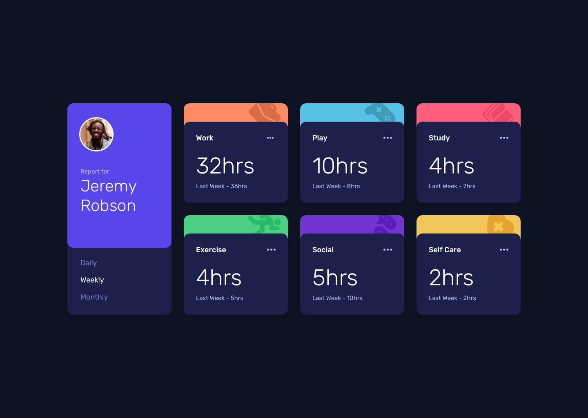
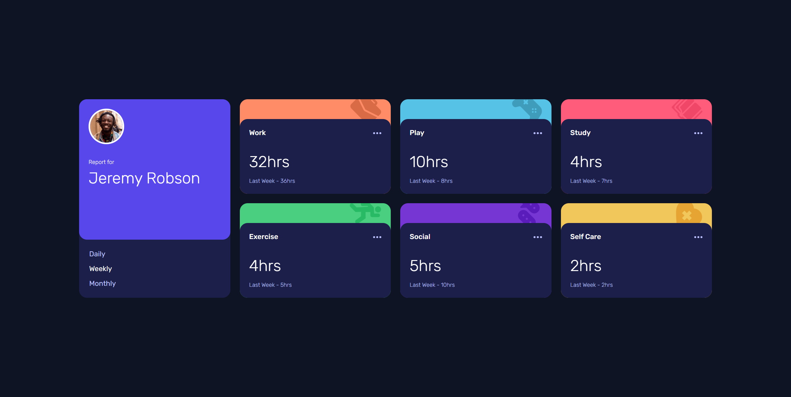

# Frontend Mentor - Time tracking dashboard solution

This is a solution to the [Time tracking dashboard challenge on Frontend Mentor](https://www.frontendmentor.io/challenges/time-tracking-dashboard-UIQ7167Jw).

## Table of contents

- [Overview](#overview)
  - [The challenge](#the-challenge)
  - [Screenshot](#screenshot)
  - [Links](#links)
- [My process](#my-process)
  - [Built with](#built-with)
  - [Continued development](#continued-development)
- [Author](#author)

## Overview

### The challenge

Users should be able to:

- View the optimal layout for the site depending on their device's screen size
- See hover states for all interactive elements on the page
- Switch between viewing Daily, Weekly, and Monthly stats

### Screenshot

#### Design

#### Solution

### Links

- Solution URL: [https://github.com/joaskr/time-tracking-dashboard](https://github.com/joaskr/time-tracking-dashboard)
- Live Site URL: [https://time-tracking-dashboard-opal.vercel.app](https://time-tracking-dashboard-opal.vercel.app)

## My process

### Built with

- Semantic HTML5 markup
- CSS custom properties
- Flexbox
- CSS Grid
- Mobile-first workflow
- Local storage

### Continued development

As a next step I want to integrate this app with Firebase and add register/login page, fetching data from firebase db and add a modal window for adding time entries.

## Author

- Frontend Mentor - [@joaskr](https://www.frontendmentor.io/profile/joaskr)
- Github - [@joaskr](https://github.com/joaskr)

